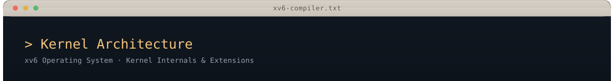

<div align="center">
  
</div>

<br>

## Overview

This repository contains a series of kernel-level extensions to MIT's xv6 operating system -- a minimal Unix reimplementation for x86. The work spans four areas of operating system internals: system call implementation, CPU scheduling algorithms, virtual memory management with demand paging, and file system extensions with multi-level block indexing.

Each modification operates directly on kernel data structures, trap handlers, and the syscall dispatch table. Scheduling variants and memory allocators are selectable at compile time via preprocessor directives, allowing direct comparison of design tradeoffs on identical workloads.

<br>

## Technology Stack

<table>
<tr>
<td><strong>Language</strong></td>
<td> </td>
</tr>
<tr>
<td><strong>Build System</strong></td>
<td> </td>
</tr>
<tr>
<td><strong>Emulation & Debug</strong></td>
<td> </td>
</tr>
<tr>
<td><strong>Platform</strong></td>
<td>  </td>
</tr>
</table>

## Engineering Principles

### 1. Modify kernel internals with minimal surface area
Every extension touches only the files that must change. New system calls follow the existing dispatch pattern: number in `syscall.h`, pointer in `syscall.c`, implementation in `sysproc.c`, user stub in `usys.S`. No framework, no abstraction layer -- direct integration with xv6's conventions.

> **Goal:** Each modification is traceable to a specific kernel mechanism and reviewable in isolation.

### 2. Use compile-time configuration for variant selection
Scheduling algorithms (round-robin, SJF, lottery) and memory allocators (lazy, locality-aware) are selected via Makefile variables and `#ifdef` directives. The same kernel source supports multiple behaviors without runtime overhead or conditional branching in hot paths.

> **Goal:** Compare design tradeoffs on identical hardware and workloads with zero runtime cost.

### 3. Handle faults at the lowest possible level
Page faults from lazy allocation are caught in the trap handler and resolved by allocating physical pages on demand. The kernel never panics on a valid lazy-allocated address -- it maps the page transparently and returns to user space.

> **Goal:** User programs see a contiguous address space regardless of the underlying allocation strategy.

### 4. Extend existing abstractions rather than replacing them
The file system uses xv6's existing `bmap()` / `itrunc()` pattern, extending it from single-indirect to double-indirect block indexing. Symlinks reuse the inode and directory infrastructure. No parallel data structures compete with the original design.

> **Goal:** Additions compose with the existing kernel rather than forking it.

---

## System Calls & User Programs

The first project establishes the end-to-end system call path and adds utility programs to the xv6 userland.

**New system calls:**

| Syscall | Number | Description |
| :--- | :--- | :--- |
| `hello` | 22 | Prints a kernel-space greeting message via `cprintf` |

**User programs:**

| Program | Description |
| :--- | :--- |
| `hello` | Invokes the `hello` syscall to verify the end-to-end path |
| `sleep` | Sleeps for a specified number of ticks using the `sleep()` syscall |
| `ls` | Modified to hide dotfiles by default, `-a` flag to show all, `/` suffix on directories |

> **Demonstrates:** Full syscall lifecycle -- user stub, `int T_SYSCALL` trap, dispatch table, kernel implementation, return to user space.

---

## CPU Scheduling

Three scheduling algorithms implemented via compile-time selection in `proc.c`. The Makefile exposes a `SCHEDULER` variable that maps to preprocessor defines, selecting the scheduler at build time.

### Round-Robin (Default)

The stock xv6 scheduler. Iterates the process table and runs the first `RUNNABLE` process found. Simple, fair, and starvation-free.

### Shortest Job First

Scans all `RUNNABLE` processes and selects the one with the lowest `predicted_job_length`. Each process is assigned a random predicted length at creation via a linear congruential generator. The scheduler performs a full table scan on every scheduling decision.

### Lottery Scheduling

Each process holds a `tickets` field (default 10, adjustable via `set_lottery_tickets` syscall). The scheduler sums all tickets across `RUNNABLE` processes, draws a random number in that range, and walks the table accumulating tickets until the winner is found. Processes with more tickets are proportionally more likely to run.

**Scheduling syscalls:**

| Syscall | Number | Description |
| :--- | :--- | :--- |
| `ticks_running` | 23 | Returns the number of ticks a process has been scheduled |
| `sjf_job_length` | 24 | Returns the predicted job length for a given PID |
| `set_lottery_tickets` | 25 | Sets the ticket count for the calling process |
| `get_lottery_tickets` | 26 | Returns the ticket count for a given PID |

**Build variants:**

```bash
make qemu SCHEDULER=DEFAULT    # Round-robin
make qemu SCHEDULER=SJF        # Shortest Job First
make qemu SCHEDULER=LOTTERY    # Lottery scheduling
```

> **Demonstrates:** Compile-time kernel configuration, process metadata extension (`struct proc` fields), and the tradeoff between fairness and responsiveness across scheduling policies.

---

## Virtual Memory

Two demand-paging allocators implemented in the trap handler. The `sbrk()` syscall is modified to only update `proc->sz` without allocating physical memory. Actual allocation happens on page fault via `T_PGFLT` in `trap()`.

### Lazy Allocator

On page fault, allocates a single 4KB page at the faulting address using `kalloc()`, zero-fills it, and maps it into the process page table via `mappages()`. Each fault allocates exactly one page.

### Locality-Aware Allocator

On page fault, allocates up to 3 contiguous pages starting from the faulting address. This amortizes the cost of future faults for sequential access patterns by pre-mapping adjacent pages in a single fault handler invocation.

**Build variants:**

```bash
make qemu ALLOCATOR=LAZY       # Single-page allocation on fault
make qemu ALLOCATOR=LOCALITY   # Multi-page locality-aware allocation
```

**Test programs:**

| Test | Description |
| :--- | :--- |
| `lazyallocatedtest` | Allocates 6 pages via `sbrk`, accesses them sequentially to trigger faults |
| `stress-test` | 4 subtests: sequential access (20 pages), random access, sparse access, reallocation cycle |
| `sbrktest` | Validates `sbrk` behavior under the modified allocator |

> **Demonstrates:** Trap-level fault handling, physical page allocation, page table manipulation via `mappages()`, and the performance tradeoff between per-fault granularity and speculative pre-allocation.

---

## File System Extensions

### Double-Indirect Block Indexing

The default xv6 inode supports 12 direct blocks and 1 indirect block (140 blocks max, ~70KB per file). This extension reduces direct blocks to 10 and adds 2 double-indirect block pointers, expanding maximum file size to 10 + 128 + 2(128 x 128) = 32,906 blocks (~16MB).

**Modified structures:**
- `fs.h`: `NDIRECT=10`, `addrs[NDIRECT+3]` (10 direct + 1 indirect + 2 double-indirect)
- `fs.c`: `bmap()` extended with nested block lookup; `itrunc()` extended with 3-level deallocation

### Symbolic Links

Full `symlink()` syscall implementation with recursive resolution and safety bounds:
- `sys_symlink()` creates a `T_SYMLINK` inode and writes the target path into its first data block
- `sys_open()` resolves symlinks iteratively up to `MAXSYMLINKS` (10) depth, detecting cycles
- `O_NOFOLLOW` flag (`0x800`) in `fcntl.h` suppresses symlink resolution on open

### Seek Support

`lseek()` syscall for random file access with hole semantics -- seeking past the current end of file and writing creates zero-filled gaps.

**Test programs:**

| Test | Description |
| :--- | :--- |
| `symlinktest` | Symlink creation, `O_NOFOLLOW`, recursive chains, cyclic detection |
| `lseektest` | Write-seek-write with zero-filled hole verification |

> **Demonstrates:** Multi-level block indexing in `bmap()`, inode type extension, iterative path resolution with cycle detection, and file descriptor seek semantics.

---

## Hardest Problems Solved

### 1. Demand Paging Without Kernel Panic

**Problem:** Stock xv6 panics on any page fault. Modifying `sbrk()` to defer allocation means every heap access by every user program triggers a fault that must be handled correctly -- or the kernel crashes.

**Solution:** The trap handler intercepts `T_PGFLT`, validates the faulting address against `proc->sz`, allocates and zero-fills a physical page via `kalloc()`, maps it with `mappages()`, and returns to user space. Invalid addresses (above `proc->sz` or below the stack) still trigger a kill. The locality-aware variant extends this to pre-map adjacent pages, reducing fault frequency for sequential workloads.

### 2. Double-Indirect Block Mapping and Deallocation

**Problem:** Extending `bmap()` from single-indirect to double-indirect indexing requires correct two-level pointer traversal for reads and writes, plus a matching three-level deallocation pass in `itrunc()` that frees every allocated block without leaking.

**Solution:** `bmap()` checks direct blocks first, then the single-indirect table, then iterates both double-indirect tables with nested lookups. `itrunc()` mirrors this structure: it walks each double-indirect pointer, frees every block in each second-level table, frees the table itself, then frees the top-level pointer. Block allocation is lazy -- intermediate tables are only allocated when `bmap()` is called with `alloc=1`.

### 3. Symlink Resolution with Cycle Detection

**Problem:** Symlinks can form cycles (A -> B -> C -> A). Naively following links without a depth bound causes infinite recursion in `sys_open()`, hanging the kernel.

**Solution:** `sys_open()` resolves symlinks iteratively (not recursively) with a `depth` counter bounded by `MAXSYMLINKS=10`. Each resolution step reads the target path from the symlink inode's data block, calls `namei()` to resolve it, and checks if the result is another symlink. If depth exceeds 10, the open fails with an error. The `O_NOFOLLOW` flag bypasses resolution entirely, returning the symlink inode directly.

<br>

## Kernel Modifications Summary

| Area | Files Modified | Key Changes |
| :--- | :--- | :--- |
| **Syscall Dispatch** | `syscall.h`, `syscall.c`, `sysproc.c`, `usys.S`, `user.h` | 5 new syscall numbers, dispatch entries, and implementations |
| **Process Metadata** | `proc.h`, `proc.c` | `ticks`, `predicted_job_length`, `tickets` fields in `struct proc` |
| **Scheduler** | `proc.c`, `Makefile` | `#ifdef`-gated SJF and lottery schedulers with compile-time selection |
| **Trap Handler** | `trap.c` | `T_PGFLT` handler with lazy and locality-aware allocation paths |
| **Memory** | `sysproc.c` | `sys_sbrk()` modified to defer physical allocation |
| **File System** | `fs.h`, `fs.c`, `sysfile.c`, `stat.h`, `fcntl.h` | Double-indirect blocks, `T_SYMLINK` type, `O_NOFOLLOW`, `sys_symlink()`, `sys_lseek()` |
| **User Programs** | `hello.c`, `sleep.c`, `find.c`, `uniq.c`, `ls.c` | New utilities and modified builtins |

---

## Building & Running

Each project directory contains a self-contained xv6 build. Navigate to the desired project and run:

```bash
# Default build (round-robin scheduler, no lazy allocation)
make qemu

# With scheduler variants (Project 2)
make qemu SCHEDULER=SJF
make qemu SCHEDULER=LOTTERY

# With allocator variants (Project 3)
make qemu ALLOCATOR=LAZY
make qemu ALLOCATOR=LOCALITY

# Non-graphical mode
make qemu-nox
```

Clean and rebuild:

```bash
make clean && make qemu
```

---

<details>
<summary><h2>Project Structure</h2></summary>
<br>

```
.
├── README.md
├── xv6-public-Programs and Implementing Shell Command and System Calls/
│   ├── Makefile
│   ├── Modified code/                     # Per-task diff snapshots
│   │   ├── Task 1/
│   │   ├── Task 2/
│   │   ├── Task 3/
│   │   └── Task 4/
│   ├── screenshots/                       # Build and test output
│   ├── hello.c                            # hello syscall user program
│   ├── sleep.c                            # Sleep command
│   ├── ls.c                               # Modified ls with -a flag
│   └── [xv6 kernel source]
├── xv6-public-System Calls and schedulers/
│   ├── Makefile                           # SCHEDULER variable (DEFAULT/SJF/LOTTERY)
│   ├── proc.c                             # Three scheduler implementations
│   ├── proc.h                             # Extended struct proc
│   ├── syscall.c / syscall.h              # Dispatch table with 5 new entries
│   ├── sysproc.c                          # Custom syscall implementations
│   ├── find.c                             # Recursive file finder
│   ├── uniq.c                             # Line deduplication tool
│   ├── scheduler_test.c                   # CPU/IO/pipe benchmark suite
│   ├── advanced_scheduler_test.c          # Lottery ticket distribution test
│   └── [xv6 kernel source]
└── xv6-public- Virtual Memory with Allocators/
    ├── Makefile                           # ALLOCATOR variable (LAZY/LOCALITY)
    ├── trap.c                             # Page fault handler
    ├── fs.h                               # Extended inode (double-indirect)
    ├── fs.c                               # bmap() and itrunc() with 3-level indexing
    ├── sysfile.c                          # sys_symlink(), symlink resolution in open()
    ├── stat.h                             # T_SYMLINK type
    ├── fcntl.h                            # O_NOFOLLOW flag
    ├── lazyallocatedtest.c                # Demand paging validation
    ├── stress-test.c                      # Memory allocator stress suite
    ├── symlinktest.c                      # Symlink creation, cycles, O_NOFOLLOW
    ├── lseektest.c                        # Seek with hole verification
    └── [xv6 kernel source]
```

</details>

---

<div align="center">
  
</div>
